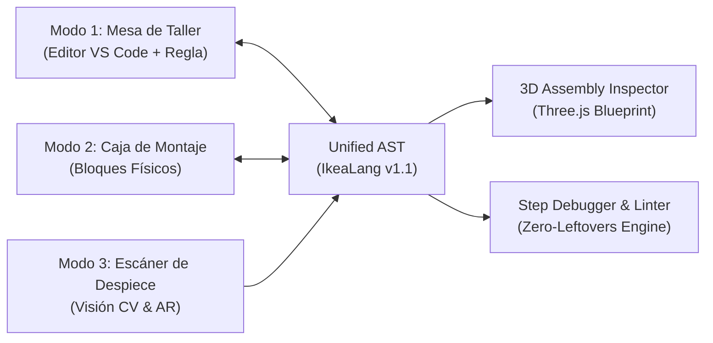

# 🪑 IKEALang IDE | KALLAX Studio v1.1

**Lenguajes y Paradigmas (LyP 2026)**  
* **Autores:** Marcos García Guerra, Jean Carlo Quezada Calva, Eric Specht De la Torre

> **El entorno de desarrollo integrado (IDE) donde la lógica de programación se mapea directamente a los principios de ensamblaje de muebles en paquete plano (*flat-pack*).**

---

## 📐 1. Los Tres Modos Sincronizados de Trabajo

El IDE implementa una arquitectura reactiva con un **Árbol de Sintaxis Abstracta Unificado (Unified AST)** que sincroniza de forma bidireccional los tres modos de trabajo:



### 🔨 Modo 1: "Mesa de Taller" (Code Editor)
* **Temas Visuales:**
  * **Papel de Instrucciones (Light):** Textura de folleto técnico reciclado (`#f8f5ee`), tinta azul sueca (`#0058a3`) y resaltado amarillo (`#ffdb00`).
  * **Mesa de Corte Verde (Dark):** Superficie de tapete de corte autorreparable (`#132117`) con acentos de madera de pino y guías de regla en verde bosque.
* **Regla de Carpintero Plegable en el Gutter:** Los números de línea se renderizan con marcas milimétricas graduadas (marcas de 0mm, 10mm, 20mm).
* **Clavijas de Madera (Breakpoints):** Los puntos de interrupción se representan visualmente como espigas cilíndricas de madera de abedul insertadas en el margen.
* **Autocompletado de Montaje (Assembly Autocomplete):**
  * Sugerencias según compatibilidad física (`tablero.A_TORNILLO()`, `cajon.UNIR()`, `IMPRESORA.ESCRIBIR()`).
  * Catálogo de kits en snippets (`kit:cajon`, `kit:paso`, `kit:repetir`, `kit:entre_dos`, `kit:si`).

---

### 📦 Modo 2: "Caja de Montaje" (Visual Block Editor)
* **Paradigma de Bloques Duales:**
  * **Bloques de Ferretería (Datos):** Conectores y enchufes geométricos moldeados según componentes físicos:
    * ⚙️ **`TORNILLO`**: Ranura cilíndrica con rosca métrica en ámbar metálico.
    * 🪵 **`TABLERO`**: Junta de espiga machihembrada en madera de abedul.
    * 🔒 **`ENCAJE`**: Cierre de clic mecánico verde esmeralda.
    * 🗄️ **`CAJON`**: Guía corredera telescópica de acero.
    * 🔗 *Prevención de errores en drag-time:* Los tipos incompatibles no encajan físicamente.
  * **Bloques de Herramienta (Control de Flujo):**
    * 🔄 **`REPETIR`**: Trinquete / atornillador eléctrico con cuentarrevoluciones digital.
    * 📐 **`SI / SINO`**: Escuadra metálica de 90 grados para validación de equilibrio.
    * 👥 **`ENTRE_DOS`**: Sargento paralelo de doble husillo con empuñaduras de seguridad antivuelco.
* **Sincronización Bidireccional en Tiempo Real:** Modificar o encajar bloques en la lona genera y formatea código `.ikea` instantáneamente; escribir en el editor regenera la disposición de bloques visuales.

---

### 📷 Modo 3: "Escáner de Despiece" (Visión por Computador & AR)
* **Entrada por Cámara / Galería de Muebles:** Captura en vivo mediante webcam o presets de escaneo de alta resolución (Mesa LACK, Estantería KALLAX 2x2, Cajonera ALEX).
* **Detección y Segmentación Espacial:** Segmenta superficies (tableros horizontales/verticales), patas cilíndricas, compartimentos y estima los tornillos/clavijas necesarios con dimensiones milimétricas reales.
* **Reconstrucción Automática de Código:** Genera un script `.ikea` 100% válido y listo para transferir a la Mesa de Taller.
* **Vista Despiezada AR (Exploded View):** Deslizador interactivo de 0% a 100% de explosión para examinar el orden de ensamblaje inverso viñeta a viñeta.

---

### 📐 3D Assembly Inspector (Three.js Isometric Blueprint)
* Vista isométrica técnica que avanza viñeta a viñeta a medida que se ejecutan los pasos (`PASO 1`, `PASO 2`, etc.) durante la depuración.
* 3 Modos de renderizado en vivo:
  1. **Plano Blueprint Azul:** Fondo técnico con retícula y mallas alámbricas en cian.
  2. **Madera Real:** Texturas de abedul natural, tornillos de acero y sombras dinámicas.
  3. **Manual B&N:** Estilo viñeta limpia de folleto de montaje IKEA.
* Controles de rotación orbital, zoom, centrado y despiece espacial.

---

## 📜 2. Especificación Oficial de IkeaLang v1.1

### 2.1 Anatomía Canónica
```ikea
MUEBLE MesaAuxiliarLack

HERRAMIENTAS {
    TRAER IMPRESORA
    TRAER LLAVE_ALLEN
    TRAER MATEMATICAS COMO Calc
}

CAJA {
    TABLERO tablero_superior = "Tablero Lack 55x55cm"
    TORNILLO patas_totales = 4
    TORNILLO tornillos_fijacion = 4
    CAJON patas_montadas = []
    TABLERO estado = "Desembalado"
}

MONTAJE {
    PASO 1: "Desempaquetar tablero y preparar patas" {
        IMPRESORA.ESCRIBIR("Iniciando montaje de: " UNIR tablero_superior)
        estado = "Tablero listo boca abajo"
    }

    PASO 2: "Enroscar las cuatro patas cilíndricas" {
        REPETIR patas_totales VECES {
            patas_montadas.UNIR("Pata_Fijada")
        }
        tornillos_fijacion = tornillos_fijacion RETIRAR patas_totales
        IMPRESORA.ESCRIBIR("Patas atornilladas firmemente.")
    }

    PASO 3: "Comprobar estabilidad final" {
        SI patas_montadas.LONGITUD() ENCAJA 4 {
            estado = "Mesa Lack ensamblada y estable"
            IMPRESORA.ESCRIBIR(estado)
        } SINO {
            AVISO("Faltan patas por colocar")
        }
    }
}

TERMINADO estado;
```

### 2.2 Principio Zero-Leftovers y Reglas del Linter
* **`ERROR 101: PIEZAS_SOBRANTES`**: Si una variable declarada en la `CAJA` o una herramienta en `HERRAMIENTAS` no se consume en ningún `PASO`, la compilación se interrumpe. El muñeco de IKEA (*Gubbe*) aparece en el gutter rascándose la cabeza para indicar dónde está la pieza olvidada.
* **`ERROR 102: TORNILLO_PASADO`**: Conflicto de tipos estáticos o forzado de rosca (asignación errónea sin `.A_TORNILLO()`).
* **`ERROR 103: FALTA_HERRAMIENTA`**: Intento de utilizar funciones de una herramienta no importada previamente en `HERRAMIENTAS`.
* **`PANICO: VUELCO`**: Error fatal emitido si se ejecutan tareas pesadas, llamadas de red o transformaciones de datos sin el bloque protector `ENTRE_DOS { ... }`.

---

## 🚀 3. Instrucciones de Ejecución y Pruebas

### 3.1 Iniciar el Servidor de Desarrollo
```bash
npm run dev
```
Abre en tu navegador: `http://localhost:3000/` o `http://127.0.0.1:3000/`

### 3.2 Ejecutar la Suite de Pruebas Automatizadas
Verifica los 26 tests unitarios del Lexer, Parser, Linter, Intérprete y Formateador:
```bash
npm test
```

### 3.3 Compilar para Producción
```bash
npm run build
```

---

## 🛠️ Tecnologías Empleadas
* **Frontend:** React 19 + TypeScript + Vite + TailwindCSS.
* **Editor de Código:** Editor nativo estilo VS Code con resaltador léxico, autocompletado y regla graduada.
* **Renderizado 3D:** Three.js con modelos paramétricos procedurales de mobiliario.
* **Visión por Computador:** Pipeline de segmentación espacial y deconstrucción a AST con soporte de cámara WebRTC.
* **Ventana Externa del Intérprete:** Ventana pop-out independiente desacoplada para salida de depuración y consola.
* **Efectos de Sonido:** Síntesis sonora pura vía Web Audio API (chasquidos de madera, trinquetes y acordes de éxito).
* **Mascota Oficial:** Gubbe, asistente interactivo SVG del manual de montaje con feedback en tiempo real.
