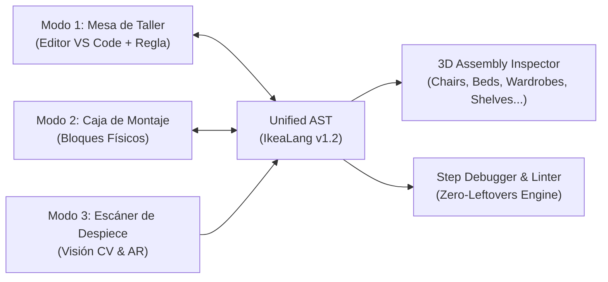

# 🪑 IKEALang IDE | KALLAX Studio v1.2

**Lenguajes y Paradigmas (LyP 2026)**  
* **Autores:** Marcos García Guerra, Jean Carlo Quezada Calva, Eric Specht De la Torre

> **El entorno de desarrollo integrado (IDE) donde la lógica de programación se mapea directamente a los principios de ensamblaje universal de muebles en paquete plano (*flat-pack*).**  
> **Garantía de Estabilidad Universal:** Construye cualquier tipología de mueble —**sillas, camas, armarios, cajoneras, estanterías, mesas**— con solidez estructural garantizada.

---

## 📐 1. Los Tres Modos Sincronizados de Trabajo

El IDE implementa una arquitectura reactiva con un **Árbol de Sintaxis Abstracta Unificado (Unified AST)** que sincroniza de forma bidireccional los tres modos de trabajo:



### 🔨 Modo 1: "Mesa de Taller" (Code Editor)
* **Temas Visuales:**
  * **Papel de Instrucciones (Light):** Textura de folleto técnico reciclado (`#f8f5ee`), tinta azul sueca (`#0058a3`) y resaltado amarillo (`#ffdb00`).
  * **Mesa de Corte Verde (Dark):** Superficie de tapete de corte autorreparable (`#132117`) con acentos de madera de pino y guías de regla en verde bosque.
* **Regla de Carpintero Plegable en el Gutter:** Los números de línea se renderizan con marcas milimétricas graduadas (marcas de 0mm, 10mm, 20mm).
* **Clavijas de Madera (Breakpoints):** Los puntos de interrupción se representan visualmente como espigas cilíndricas de madera de abedul insertadas en el margen.
* **Autocompletado de Montaje (Assembly Autocomplete):**
  * Sugerencias según compatibilidad física (`tablero.A_TORNILLO()`, `cajon.UNIR()`, `IMPRESORA.ESCRIBIR()`).
  * Catálogo de snippets universales (`kit:silla`, `kit:cama`, `kit:armario`, `kit:cajon`, `kit:paso`, `kit:repetir`, `kit:entre_dos`).

---

### 📦 Modo 2: "Caja de Montaje" (Visual Block Editor)
* **Paradigma de Bloques Duales:**
  * **Bloques de Ferretería (Datos):** Conectores y enchufes geométricos moldeados según componentes físicos:
    * ⚙️ **`TORNILLO`**: Ranura cilíndrica con rosca métrica en ámbar metálico.
    * 🪵 **`TABLERO`**: Junta de espiga machihembrada en madera de abedul.
    * 🔒 **`ENCAJE`**: Cierre de clic mecánico verde esmeralda.
    * 🗄️ **`CAJON`**: Guía corredera telescópica de acero.
    * 🔗 *Prevención de errores en drag-time:* Los tipos incompatibles no encajan físicamente.
  * **Bloques de Herramienta (Control de Flujo):**
    * 🔄 **`REPETIR`**: Trinquete / atornillador eléctrico con cuentarrevoluciones digital.
    * 📐 **`SI / SINO`**: Escuadra metálica de 90 grados para validación de equilibrio.
    * 👥 **`ENTRE_DOS`**: Sargento paralelo de doble husillo para colaboración en equipo.
* **Sincronización Bidireccional en Tiempo Real:** Modificar o encajar bloques en la lona genera y formatea código `.ikea` instantáneamente; escribir en el editor regenera la disposición de bloques visuales.

---

### 📷 Modo 3: "Escáner de Despiece" (Visión por Computador & AR)
* **Entrada por Cámara / Galería de Muebles:** Captura en vivo mediante webcam o presets de escaneo de mobiliario real.
* **Detección y Segmentación Espacial:** Segmenta superficies (tableros horizontales/verticales), patas cilíndricas, compartimentos y estima los tornillos/clavijas necesarios con dimensiones milimétricas reales.
* **Reconstrucción Automática de Código:** Genera un script `.ikea` 100% válido y listo para transferir a la Mesa de Taller.
* **Vista Despiezada AR (Exploded View):** Deslizador interactivo de 0% a 100% de explosión para examinar el orden de ensamblaje inverso viñeta a viñeta.

---

### 📐 3D Universal Assembly Inspector (Three.js Isometric Blueprint)
* **Soporte Paramétrico Procedural para Todo Tipo de Mueble:**
  * 🪑 **Sillas:** Asiento macizo, 4 patas con refuerzos y respaldo de barrotes torneados.
  * 🛏️ **Camas:** Cabecero alto, piecero, largueros de soporte, viga central y somier con láminas de madera.
  * 🚪 **Armarios:** Bastidor alto vertical, baldas regulables interiores, barra de colgar y 2 puertas batientes.
  * 🗄️ **Cajoneras:** Chasis perimetral con guías correderas y 5 cajones extraíbles.
  * 📚 **Estanterías:** Ensamblaje cúbico modular (2x2) con separadores simétricos.
  * 🛋️ **Mesas:** Tablero horizontal con fijación cuádruple de patas.
* **Detección Dinámica Automática:** El visor reconoce el modelo 3D idóneo a partir del nombre o contenido del código `MUEBLE`.
* 3 Modos de renderizado: Blueprint técnico cian, Madera de abedul natural o Manual B&N.

---

## 📜 2. Especificación Oficial de IkeaLang v1.2

### 2.1 Ejemplo Canónico: Silla de Comedor INGOLF
```ikea
MUEBLE SillaComedorIngolf

HERRAMIENTAS {
    TRAER IMPRESORA
    TRAER LLAVE_ALLEN
}

CAJA {
    TABLERO asiento_madera = "Asiento de Pino Macizo 40x40cm"
    TORNILLO patas_delanteras = 2
    TORNILLO patas_traseras = 2
    TORNILLO travesanos_respaldo = 3
    TORNILLO tornillos_ensamble = 12
    TABLERO estado_silla = "Piezas listas en taller"
}

MONTAJE {
    PASO 1: "Ensamblar patas y refuerzos inferiores" {
        TORNILLO total_patas = patas_delanteras UNIR patas_traseras
        tornillos_ensamble = tornillos_ensamble RETIRAR 8
        IMPRESORA.ESCRIBIR("Patas alineadas y aseguradas: " UNIR total_patas)
    }

    PASO 2: "Fijar asiento de madera maciza" {
        asiento_madera = asiento_madera UNIR " + Estructura Inferior Firme"
        IMPRESORA.ESCRIBIR("Asiento atornillado con máxima estabilidad.")
    }

    PASO 3: "Acoplar travesaños del respaldo" {
        tornillos_ensamble = tornillos_ensamble RETIRAR 4
        SI travesanos_respaldo ENCAJA 3 {
            estado_silla = "Silla INGOLF ensamblada con total firmeza y confort"
            IMPRESORA.ESCRIBIR(estado_silla)
        }
    }
}

TERMINADO estado_silla;
```

### 2.2 Principio Zero-Leftovers y Reglas del Linter
* **`ESTABILIDAD TOTAL CERTIFICADA`**: Cualquier mueble ensamblado en IkeaLang queda estructuralmente libre de oscilaciones o vuelcos.
* **`ERROR 101: PIEZAS_SOBRANTES`**: Si una variable declarada en la `CAJA` o una herramienta en `HERRAMIENTAS` no se consume en ningún `PASO`, la compilación se interrumpe. El muñeco de IKEA (*Gubbe*) aparece en el gutter rascándose la cabeza para indicar dónde está la pieza olvidada.
* **`ERROR 102: TORNILLO_PASADO`**: Conflicto de tipos estáticos o forzado de rosca (e.g. asignar texto a variable numérica).
* **`ERROR 103: FALTA_HERRAMIENTA`**: Intento de utilizar funciones de una herramienta no importada previamente en `HERRAMIENTAS`.

---

## 🚀 3. Instrucciones de Ejecución y Pruebas

### 3.1 Iniciar el Servidor de Desarrollo
```bash
npm run dev
```
Abre en tu navegador: `http://localhost:3000/` o `http://127.0.0.1:3000/`

### 3.2 Ejecutar la Suite de Pruebas Automatizadas
Verifica los 39 tests unitarios del Lexer, Parser, Linter, Intérprete y Modelos 3D de Mobiliario Universal:
```bash
npm test
```

### 3.3 Compilar para Producción
```bash
npm run build
```

---

## 🛠️ Tecnologías Empleadas
* **Frontend:** React 19 + TypeScript + Vite + TailwindCSS.
* **Editor de Código:** Editor nativo estilo VS Code con resaltador léxico, autocompletado y regla graduada.
* **Renderizado 3D Universal:** Three.js con geometrías procedurales para sillas, camas, armarios, cajoneras, estanterías y mesas.
* **Visión por Computador:** Pipeline de segmentación espacial y deconstrucción a AST con soporte de cámara WebRTC.
* **Ventana Externa del Intérprete:** Ventana pop-out independiente desacoplada para salida de depuración y consola.
* **Efectos de Sonido:** Síntesis sonora pura vía Web Audio API (chasquidos de madera, trinquetes y acordes de éxito).
* **Mascota Oficial:** Gubbe, asistente interactivo SVG del manual de montaje con feedback en tiempo real.
